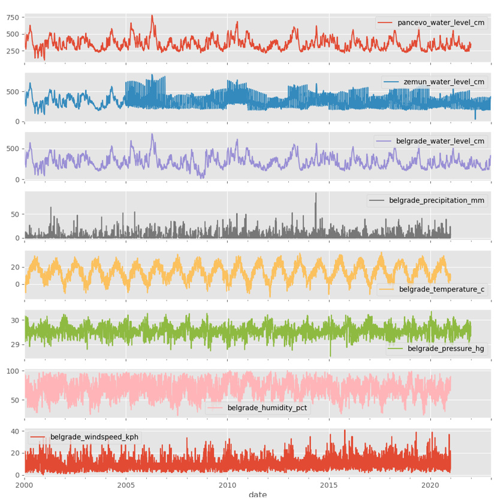
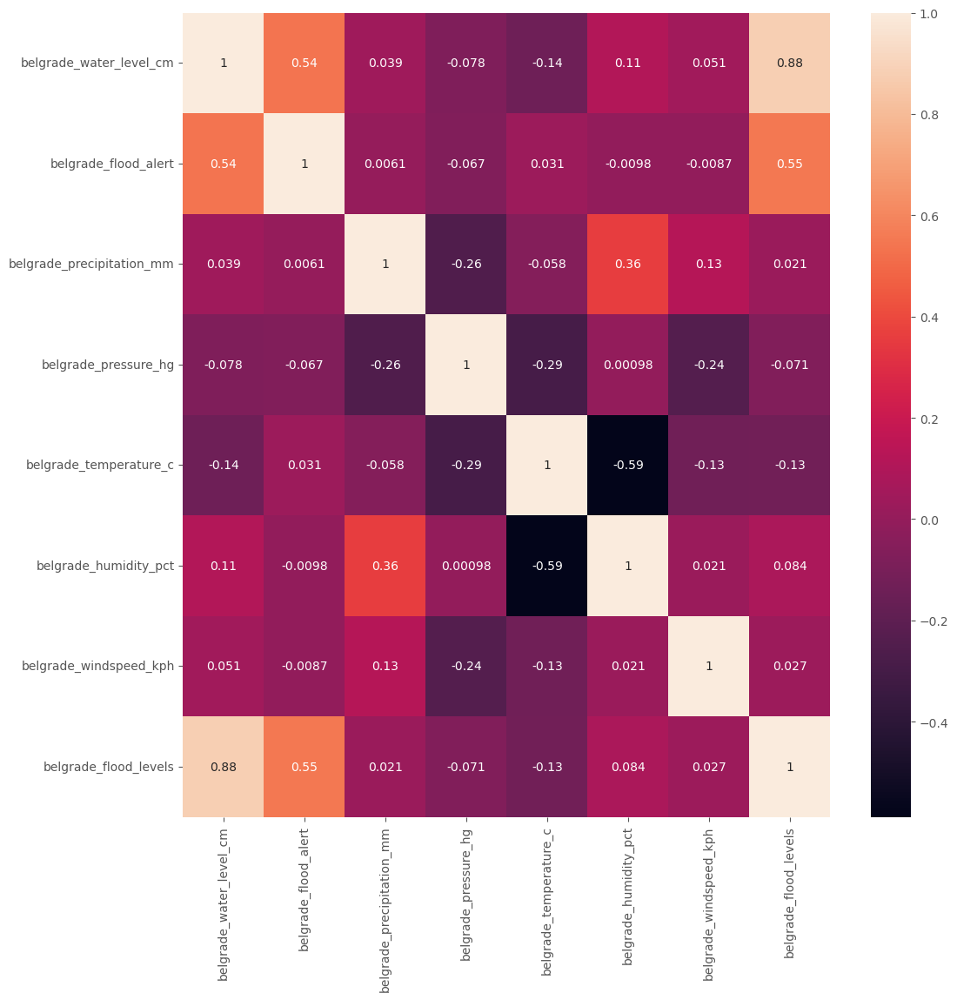
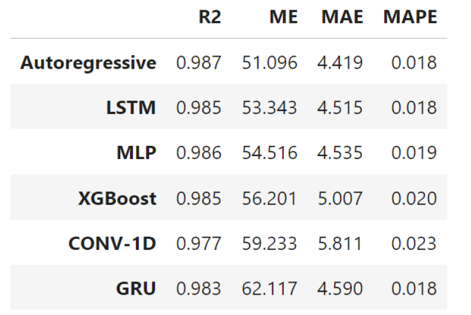
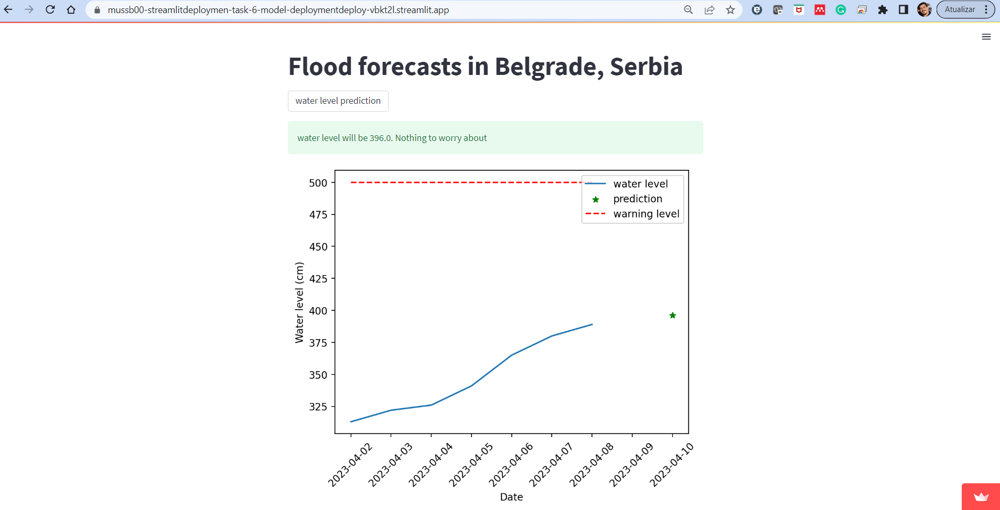

# Reducing Flood Risks in Belgrade Area through AI Solutions

This is a collaborative open source project promoted by Omdena Belgrade Chapter.

Project detailed description: https://omdena.com/chapter-challenges/reducing-floods-risks-in-belgrade-area-through-ai-solutions/

## Objectives

The main goal is be the creation of a supervised ML model, based on historical weather and hydrological data for Danube, Sava and other small rivers in Belgrade area, which will bring a prediction of possible floods in the future. 

## Data collection

## EDA - Exploratory Data Analysis

## Time Series Forecasting Models

*Table 1: Error metrics for each model implemented.*

*Table 2: Descriptive statistics for the absolute error of each model.*

## Streamlit Web App Deployed

The team deplyed a web app created with Streamlit Python framework for simple predictions based on the time serires forecasting models developed.

https://mussb00-streamlitdeploymen-task-6-model-deploymentdeploy-vbkt2l.streamlit.app/

