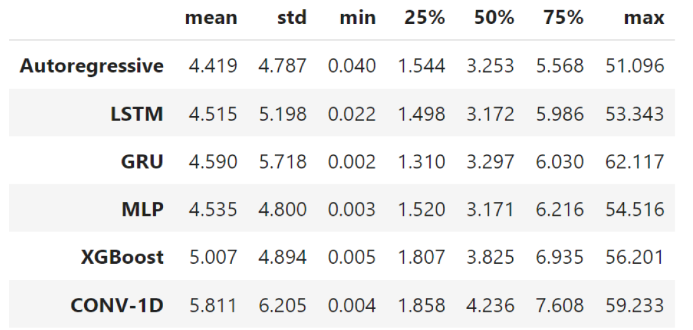

# Reducing Flood Risks in Belgrade Area through AI Solutions

This is a collaborative open source project promoted by Omdena Belgrade Chapter.

Belgrade is a city (capital of Serbia) located on the delta of two rivers, the Sava and Danube, with 200 km length of the waterfronts. In recent decade, Belgrade was affected with manyfloods, where one from 2014 was devastating. Obrenovac, one of Belgradee municipalities, was totally flooded, over 30000 people were relocated, around 10000 houses were devastated.

Project detailed description: https://omdena.com/chapter-challenges/reducing-floods-risks-in-belgrade-area-through-ai-solutions/

## Objectives

The main goal is be the creation of a supervised ML model, based on historical weather and hydrological data for Danube, Sava and other small rivers in Belgrade area, which will bring a prediction of possible floods in the future. 

In this project I was responsible for preprocessing (clenaning and merging) data collected. I the sequence I collaborated in the model development team in the creation of different ML and DL time series forecasting models.

## Data Collection and EDA (Exploratory Data Analysis)

Data has been collected for three stations (Zemun, Pancevo and Belgrade) mainly from the database from Serbia Republic Hidmet Service.

https://www.hidmet.gov.rs/index_eng.php

The team worked in different fronts in order to scrape data from several PDF files (most of them in Serbian language). After some iterations of collecting, cleaning and merging data, all the variables are presented in the picture below.

The preliminary regression and classification models created presented very poor results and the team decided to move forward with time series forcasting models.

## Time Series Forecasting Models

After data colletction and EDA the team decided to create time series forcasting models in order to predict the level of Sava river in the station located at Belgrade.

The figure below presents the daily data for Belgrade water level in cm from 2000 to 2020.

The training data was selected from 2000 to the end of 2019 and the year for 2020 was separate as test set. The flood alert level for Sava river in this is sation is 500 cm, that is, water levels higher than 500cm indicate risk of flood.

Different lags in the data were tested and the final models were build uising 7 days of fixed lag window in the time history.

The results and error metrics for different models created are in the tables and figures below.

Most of the models presented similar fair performance with average errors around 5 cm, and all of them presented difficulty to capture extreme values with errors in the peak values higher than 50 cm. This can be a point of improvement and fine tuning of the models in future projects since floods represent extreme values that can be predicted accuratelly.

*Table 1: Error metrics for each model implemented.*

*Table 2: Descriptive statistics for the absolute error of each model.*

## Streamlit Web App Deployed

The team deplyed a web app created with Streamlit Python framework for simple predictions based on the time serires forecasting models developed.

https://mussb00-streamlitdeploymen-task-6-model-deploymentdeploy-vbkt2l.streamlit.app/

